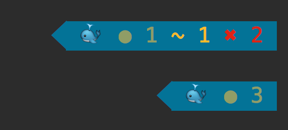

# Powerline Docker

A [Powerline](https://github.com/powerline/powerline) segment for showing Docker container statuses.

Currently, this segment shows the number of running and exited containers together with a nice looking whale. Please feel free to propose more features and give me ideas on how to improve it.



Glossary
--------
- `●`: n containers running
- `✖`: n containers exited

## Requirements

The Docker segment requires [docker](https://docs.docker.com/engine/installation/) and [docker-py](https://docker-py.readthedocs.org).

## Installation

```
$ git clone https://github.com/adrianmo/powerline-docker.git
$ cd powerline-docker
$ python setup.py install
```

The Docker segment uses a couple of custom highlight groups. You'll need to define those groups in your colorscheme, for example in `.config/powerline/colorschemes/default.json`:

```json
{
  "groups": {
    "docker":                    { "fg": "gray8",           "bg": "darkestblue", "attrs": [] },
    "docker_running":            { "fg": "green",           "bg": "darkestblue", "attrs": [] },
    "docker_exited":             { "fg": "brightred",       "bg": "darkestblue", "attrs": [] },
    "docker:divider":            { "fg": "gray8",           "bg": "darkestblue", "attrs": [] }
  }
}
```

Then you can activate the Docker segment by adding it to your segment configuration, for example in `.config/powerline/themes/shell/default.json`:

```json
{
    "function": "powerline_docker.docker",
    "priority": 30
}
```

By default the segment tries to connect to the Docker engine at `unix://var/run/docker.sock`, which is where it lives on most Unix systems. If your Docker engine is not living there, you can change the URL with the `base_url` argument. For example:

```json
{
    "function": "powerline_docker.docker",
    "priority": 30,
    "args": {
        "base_url": "tcp://192.168.99.109:2376"
    }
}
```

## License

Licensed under the [MIT License](LICENSE).

---

Inspired by [powerline-gitstatus](https://github.com/jaspernbrouwer/powerline-gitstatus).
